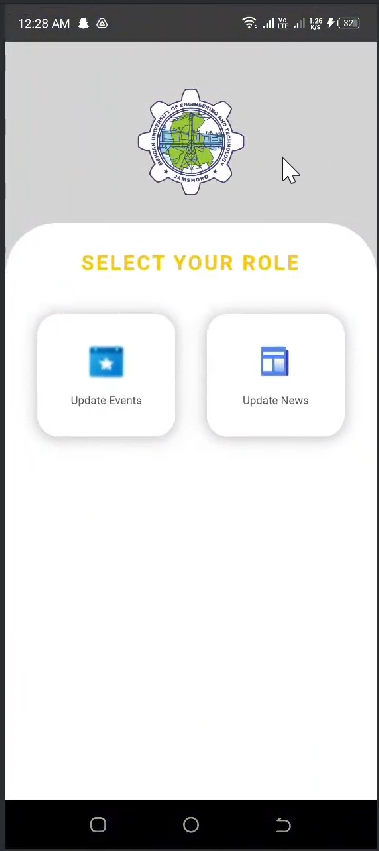
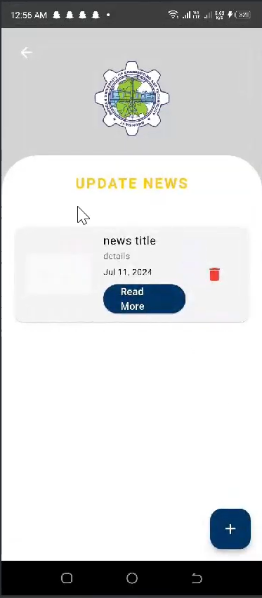
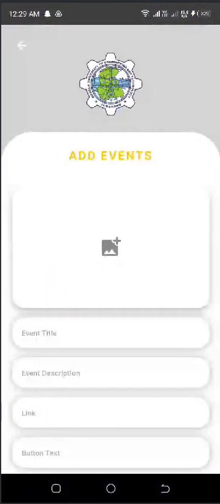

# 🏛️ MUET Admin App  

**A content management app for Mehran University's official app**  
*(Developed during an internship with Mehran University Content Development Team)*  

📹 [Watch Demo Video](https://drive.google.com/file/d/1J14POEGXse-NLIsit33wgizUHCgehJu7/view?usp=drive_link)  

---

## 📌 Overview  
A Flutter-based **admin panel** to manage all content displayed in Mehran University's official app. Enables CRUD operations for:  
- 📢 News/Announcements  
- 🕒 Timetables  
- 🎓 Faculty/Department Data  
- 🔔 Notifications  

---

## 🛠️ Tech Stack  
- **Frontend**: Flutter  
- **Backend**:  
  - **Firebase Auth** (User authentication)  
  - **Cloud Firestore** (NoSQL database for CRUD operations)  
  - **Firebase Storage** (File uploads, e.g., PDF timetables)  
- **Local Storage**: Shared Preferences (User sessions/caching)  

---

## 🔥 Key Features  
✅ **Role-Based Access Control** (Admin vs. Editor)  
✅ **Real-Time Data Sync** (Firestore listeners for instant updates)  
✅ **File Management** (Upload/download PDFs/images via Firebase Storage)  
✅ **Offline Support** (Cached data with Firestore offline persistence)  

---

## 🖼️ Screenshots  
| Admin Dashboard | News Management | Event Upload |  
|-----------------|-----------------|------------------|  
|  |  |  |  

---

## 🚀 Setup  
1. **Clone the repo**:  
   ```bash  
   git clone https://github.com/hammadak03/muet-admin-app.git  
2. **Add Firebase Config**:
   Replace google-services.json (Android) and GoogleService-Info.plist (iOS) with your Firebase project files.
3. **Install Dependencies**:
    ```bash
      flutter pub get
4. **Run the app**:
     ```bash
     flutter run
---
## Notes
  Developed as part of a university internship, with feedback from the content team.
  Integrated Firebase security rules to protect sensitive data.
